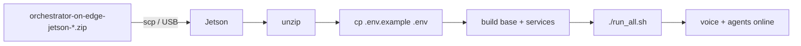

# Deploy lên Jetson (arm64)

Hướng dẫn triển khai bundle `orchestrator-on-edge-jetson-<YYYYMMDD>.zip` lên **Jetson AGX** (JetPack 6.x / r36.4, arm64). Bundle đã chứa sẵn code, config mẫu, models và wheels aarch64 — chỉ cần copy, giải nén và chạy.

> **PC (amd64)** dùng tài liệu khác: [`docs/PC_SETUP.md`](docs/PC_SETUP.md) (người dùng) hoặc [`docs/DEV_SETUP.md`](docs/DEV_SETUP.md) (dev).
> Muốn hiểu bundle được tạo ra thế nào → mục [Tạo bundle](#tạo-bundle-từ-máy-dev) bên dưới.



---

## 1. Yêu cầu trên Jetson

- **JetPack 6.x (r36.4)**, Ubuntu 22.04, **arm64**.
- **Docker** + `docker compose` + **NVIDIA container runtime** (`docker info | grep -i runtime` phải thấy `nvidia`).
- **tmux**, `bluetooth`/PulseAudio nếu dùng loa Bluetooth.
- **llama.cpp đã build native** tại `/opt/llama.cpp/bin/llama-server` (xem [mục 5](#5-chuẩn-bị-llama-server-native)). Nếu để chỗ khác, đặt biến `LLAMA_SERVER_BIN` trong `.env`.
- Dung lượng trống: **~25–30 GB** cho unzip + images (bundle ~4.3 GB).
- **Internet** trong lần build đầu (pip tải transformers/sentence-transformers/sherpa/kokoro).

## 2. Copy & giải nén

```bash
# từ máy dev (host có file zip)
scp orchestrator-on-edge-jetson-<YYYYMMDD>.zip <user>@<jetson_ip>:~/
# hoặc dùng USB

# trên Jetson
unzip orchestrator-on-edge-jetson-<YYYYMMDD>.zip -d ~/
cd ~/orchestrator-on-edge
ls -la .env.example run_all.sh docker-compose.yml
```

## 3. Tạo `.env`

Bundle **không** kèm `.env` thật (vì chứa secret). Tạo từ template rồi điền:

```bash
cp .env.example .env
nano .env
```

Các giá trị **bắt buộc** phải điền:

| Biến | Ghi chú |
|------|---------|
| `GRAPHQL_API_KEY`, `GRAPHQL_HOST`, `GRAPHQL_VEHICLE_ID` | Backend xe |
| `SUDO_PWD` | Mật khẩu sudo cho `run_all.sh` |
| `SPEAKER_MAC_ADDRESS` | MAC loa Bluetooth (nếu `AUDIO_MODE=bluetooth`) |
| `LLM_MODEL_DIR` | Thư mục tuyệt đối chứa GGUF trên Jetson |
| `LLM_MODEL_FILE` | Tên file GGUF (mặc định `Qwen3.5-4B-Q4_K_M.gguf`) |
| `PULSE_SINK` / `PULSE_SOURCE` | Chỉ khi `AUDIO_MODE=usb` |

> Dọn biến môi trường shell trước khi build/run để tránh đè `.env` của compose:
> `unset LOCAL_LLM_URL LOCAL_LLM_MODEL` (bài học `LOCAL_LLM_URL`).

## 4. Build images

Thứ tự bắt buộc: `l4t-jetpack` → `l4t-base` → services.

```bash
# (chỉ khi bị prune) pull base NVIDIA
docker pull nvcr.io/nvidia/l4t-jetpack:r36.4.0      # ~5.2 GB tải, ~15.5 GB trên disk

# base dùng chung (BẮT BUỘC trước khi build service)
docker build -f Dockerfile.l4t-base -t orchestrator-on-edge/l4t-base:r36.4.0-torch2.8 .
docker images orchestrator-on-edge/l4t-base           # phải có tag r36.4.0-torch2.8

# build các service
docker compose -p orch_v1 build voice_processing
docker compose -p orch_v1 build orchestrator car_control car_manual

# dọn build-cache để lấy lại vài GB
docker builder prune -f
```

> Trên Jetson không dùng `car_control_ui` (xe thật). Có thể bỏ qua service này.

## 5. Chuẩn bị `llama-server` native

`run_all.sh` gọi `llama-server` **native** (không trong container) để phục vụ GGUF:

```bash
# ví dụ build llama.cpp với CUDA cho Jetson
git clone https://github.com/ggerganov/llama.cpp /opt/llama.cpp
cmake -S /opt/llama.cpp -B /opt/llama.cpp/build -DGGML_CUDA=ON
cmake --build /opt/llama.cpp/build --config Release -j
# kết quả: /opt/llama.cpp/bin/llama-server
```

Model mặc định nằm ở `llama-cpp/models/Qwen3.5-4B-Q4_K_M.gguf` (đã có trong bundle). `run_all.sh` đọc `LLM_MODEL_DIR` + `LLM_MODEL_FILE` từ `.env`.

## 6. Chạy

```bash
chmod +x run_all.sh
./run_all.sh
```

`run_all.sh` sẽ:
1. Tạo tmux session `orch_edge` (các window: `llama`, `bluetooth`, `stack`, `audit`).
2. Setup audio (Bluetooth qua `setup_blue.sh`, hoặc USB theo `.env`).
3. Mở `llama-server` native.
4. `docker compose -p orch_v1 up --no-build`.

Xem tiến trình:

```bash
tmux attach -t orch_edge        # detach: Ctrl+b rồi d
```

## 7. Kiểm tra

```bash
curl localhost:8000/health      # orchestrator
curl localhost:8001/health      # car_control
curl localhost:8002/health      # car_manual

# trong log voice_processing (window stack) phải thấy:
#   [AEC] Active ... agc=True ns=high
```

Gửi thử một request:

```bash
curl -X POST localhost:8000/v1/orchestrator/message \
  -H "Content-Type: application/json" \
  -d '{"message": "Turn on the headlights", "session_id": "deploy"}'
```

## 8. Autostart khi boot (tùy chọn)

```bash
sudo cp orchestrator-on-edge.service /etc/systemd/system/
sudo systemctl daemon-reload
sudo systemctl enable --now orchestrator-on-edge
journalctl -u orchestrator-on-edge.service -f
```

Chi tiết (đổi user/UID, audio mode, Anker PowerConf): xem [`SYSTEMD_SETUP.md`](SYSTEMD_SETUP.md).

---

## Nội dung bundle

**Có sẵn:** code arm64 (`orchestrator/`, `agents/`, `voice_processing/`), `docker-compose.yml`, `Dockerfile.l4t-base`, `Makefile`, `run_all.sh`, `self_heal.sh`, `setup_blue*.sh`, `*.service`, docs, `.env.example`, models (GGUF, sherpa ASR/KWS, Kokoro, silero, wake words), cache embedding (`cache/orchestrator`, `cache/car_manual`), wheels aarch64, native libs `libs/*/linux/arm64`.

**Không có (cố ý loại):** mọi file x86 (`docker-compose.x86.yml`, `Dockerfile.x86*`, `*.x86`), dev tooling (`stubs/`, `run_all_pc.ps1`, `car_control_ui/`, `frontend/`), secret (`.env`, `.env.x86`), venv, build outputs, `__pycache__`.

## Tạo bundle từ máy dev

```bash
scripts/fetch_assets.sh --all       # tải đủ models + wheels (kiểm tra sha256)
scripts/pack_jetson.sh              # -> dist/orchestrator-on-edge-jetson-<YYYYMMDD>.zip
```

Windows: `.\scripts\fetch_assets.ps1 --all` rồi `.\scripts\pack_jetson.ps1`. Script `pack_jetson` chỉ đóng gói file GGUF trỏ bởi `LLM_MODEL_FILE` (tránh kèm nhiều model).

## Xử lý sự cố

| Triệu chứng | Cách xử lý |
|-------------|-----------|
| `pull access denied` khi build | Thiếu bước build `Dockerfile.l4t-base` (mục 4) |
| Log báo `[AEC] passthrough` | `.so` aarch64 không load → tạm đặt `AEC_ENABLED=0` trong `.env` |
| Mic không mở được 16k | Revert `AUDIO_SAMPLE_RATE=48000` và `AUDIO_CHUNK=2048` trong `.env` |
| Container nhận sai URL LLM | `unset LOCAL_LLM_URL LOCAL_LLM_MODEL` rồi chạy lại |
| Hết disk khi build | `docker builder prune -f`; theo dõi `df -h` (peak rồi giảm) |
| Bluetooth chưa sẵn sàng | Tăng `AUDIO_READY_TIMEOUT`; kiểm tra `SPEAKER_MAC_ADDRESS` |
