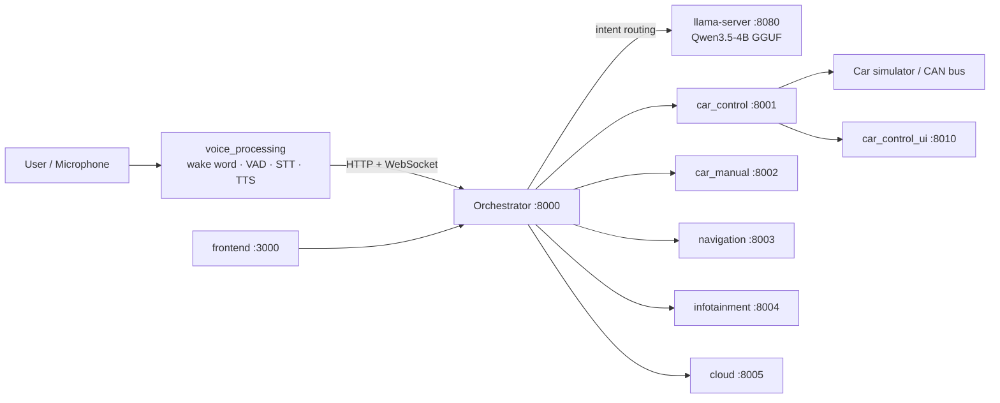
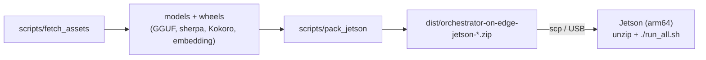

# Orchestrator on Edge

An on-device, multi-agent in-car assistant. A central **orchestrator** uses a local LLM to route each request to specialized **agents** (vehicle control, manual lookup, navigation, infotainment, cloud search), all speaking the [A2A (Agent-to-Agent) protocol](https://github.com/google/A2A). Runs fully offline on an NVIDIA Jetson (arm64) or on an amd64 dev workstation with NVIDIA GPU.

[Overview](#overview) • [Architecture](#architecture) • [Quick start](#quick-start) • [Configuration](#configuration) • [API](#api) • [Assets](#assets-and-models) • [Documentation](#documentation)

> **Documentation map**
> - Deploy to a Jetson → [`DEPLOY.md`](DEPLOY.md)
> - Set up a PC workstation (end user) → [`docs/PC_SETUP.md`](docs/PC_SETUP.md)
> - Develop on a PC (Docker / host mode) → [`docs/DEV_SETUP.md`](docs/DEV_SETUP.md)
> - Models & download sources → [`docs/ASSETS.md`](docs/ASSETS.md)

---

## Overview

A user speaks into the microphone; `voice_processing` does wake-word spotting, VAD, STT and TTS, and forwards the text to the orchestrator. The orchestrator asks a local LLM (`llama-server`) which agent(s) should handle the request, dispatches via A2A, merges the responses and streams the reply back over a WebSocket.

The whole stack is containerised and ships as one self-contained arm64 bundle for the edge device.

## Architecture



### Build & ship pipeline



## Services

| Service | Port | Description |
|---------|------|-------------|
| `orchestrator` | 8000 | FastAPI router: intent detection, agent dispatch, WebSocket streaming |
| `car_control` | 8001 | Door/window/trunk/AC control (simulated or over CAN/GraphQL) |
| `car_manual` | 8002 | RAG Q&A over the vehicle manual (BM25 + embeddings) |
| `navigation` | 8003 | Nearby POIs, directions |
| `infotainment` | 8004 | Music playback, jokes |
| `cloud` | 8005 | Web-search backed answers |
| `voice_processing` | — | Mic → wake word → VAD → STT → orchestrator → TTS |
| `car_control_ui` | 8010 | Vehicle simulation UI (amd64/dev only) |
| `frontend` | 3000 | Web chat UI (optional) |

Every agent follows the same layout: `main.py` (A2A server), `agent_card.py` (identity/skills), `agent_executor.py` (logic), `prompts.py`.

## Repository layout

```
orchestrator-on-edge/
├── orchestrator/           # central routing service (FastAPI)
├── agents/                 # car_control, car_manual, navigation, infotainment, cloud
├── voice_processing/       # audio pipeline + models + native libs
│   ├── agent_assets/       #   wake word / VAD / ASR assets
│   └── libs/               #   webrtc_apm + opus (multi-arch)
├── frontend/               # web chat UI (optional)
├── car_control_ui/         # vehicle simulator UI (dev)
├── stubs/                  # PC hardware stubs for host-mode development
├── shared/                 # shared media/sounds
├── scripts/                # fetch_assets, pack_jetson
├── docs/                   # DEV_SETUP, PC_SETUP, ASSETS
├── docker-compose.yml      # Jetson (l4t, arm64)
├── docker-compose.x86.yml  # amd64 + NVIDIA GPU
├── Dockerfile.l4t-base     # shared Jetson base image
├── Dockerfile.x86-base     # shared amd64 base image
├── run_all.sh              # Jetson launcher (tmux: bluetooth, llama, stack)
└── run_all_pc.ps1          # Windows host-mode launcher
```

## Quick start

**On a Jetson (end user):** extract the release bundle and run.

```bash
unzip orchestrator-on-edge-jetson-<date>.zip -d ~/
cd ~/orchestrator-on-edge
cp .env.example .env && nano .env      # fill GRAPHQL_*, SUDO_PWD, ...
chmod +x run_all.sh && ./run_all.sh
```

See [`DEPLOY.md`](DEPLOY.md) for the full walkthrough.

**On a PC (end user):** see [`docs/PC_SETUP.md`](docs/PC_SETUP.md).

**On a PC (developer):**

```bash
git clone <repo-url> orchestrator-on-edge && cd orchestrator-on-edge
scripts/fetch_assets.sh --all          # Windows: .\scripts\fetch_assets.ps1 --all
cp .env.x86.example .env.x86
docker compose -f docker-compose.x86.yml --env-file .env.x86 up -d
```

See [`docs/DEV_SETUP.md`](docs/DEV_SETUP.md) for the Docker and host-mode variants.

## Prerequisites

- **Jetson:** JetPack 6.x (r36.4), Docker + NVIDIA container runtime, `tmux`, a native `llama-server` (see [`DEPLOY.md`](DEPLOY.md)).
- **PC (amd64):** Docker Desktop (WSL2) or Python 3.10+, NVIDIA GPU + driver, `llama-server`/Ollama.
- **Common:** `git`, an OpenAI-compatible LLM endpoint.

## Configuration

Configuration lives in a single env file per platform (both gitignored):

- `.env` — Jetson (`run_all.sh`, `docker-compose.yml`)
- `.env.x86` — amd64 (`docker-compose.x86.yml`, `run_all_pc.ps1`)

Start from the committed templates (`.env.example`, `.env.x86.example`). Key variables:

| Variable | Default | Description |
|----------|---------|-------------|
| `ORCHESTRATOR_PORT` | `8000` | Orchestrator HTTP port |
| `LOCAL_LLM_URL` | `http://host.docker.internal:8080/v1` | OpenAI-compatible LLM endpoint |
| `LOCAL_LLM_MODEL` | `qwen3` | Model name passed to the API |
| `LLM_MODEL_FILE` | `Qwen3.5-4B-Q4_K_M.gguf` | GGUF filename under `llama-cpp/models/` |
| `OPENAI_API_KEY` | (empty) | Use OpenAI instead of the local LLM |
| `GRAPHQL_API_KEY` / `GRAPHQL_HOST` | (empty) | Vehicle backend credentials |
| `CAR_MANUAL_BRAND` | `mmc` | Manual dataset (`mmc`, `toyota`, `mercedes`) |
| `STT_BACKEND` | `sherpa_onnx` | `whisper_trt` \| `nemotron` \| `openai` \| `elevenlabs` \| `sherpa_onnx` |
| `WAKE_WORD_BACKEND` | `openwakeword` | `openwakeword` \| `sherpa_onnx` |
| `AUDIO_MODE` | `bluetooth` | `bluetooth` \| `usb` |
| `SUDO_PWD` | (empty) | Password used by `run_all.sh` for privileged steps |

> Never commit `.env`, `.env.x86` or `voice_processing/kokoro_tts/.env` — they are gitignored.

## API

Orchestrator (`:8000`):

| Method | Endpoint | Description |
|--------|----------|-------------|
| `GET` | `/health` | Liveness probe |
| `POST` | `/v1/orchestrator/message` | `{message, session_id}` — accept a request (streams via WS) |
| `WS` | `/v1/orchestrator/ws/{session_id}` | Token/event stream for a session |
| `GET` | `/v1/agents` | List registered agents |
| `GET` | `/v1/agents/catalog` | Agent catalog / capabilities |
| `POST` | `/v1/agents` | `{url}` — register an agent |
| `DELETE` | `/v1/agents/{id}` | Remove an agent |

Each agent exposes the A2A interface: `GET /.well-known/agent-card.json` and `POST /` (JSON-RPC `message/send`).

```bash
curl -X POST http://localhost:8000/v1/orchestrator/message \
  -H "Content-Type: application/json" \
  -d '{"message": "Turn on the headlights", "session_id": "demo"}'
```

## Assets and models

Large assets (GGUF, embedding model, Kokoro TTS, sherpa ASR/KWS, Jetson aarch64 wheels) are **not** in git. Fetch them with the provided script; versions are pinned to the known-good JetPack 6 bundle by sha256.

```bash
scripts/fetch_assets.sh --all          # Windows: .\scripts\fetch_assets.ps1 --all
scripts/fetch_assets.sh verify
```

See [`docs/ASSETS.md`](docs/ASSETS.md) for the full source map.

## Build & package

```bash
# build the arm64 deploy bundle (excludes all x86/dev files)
scripts/pack_jetson.sh                 # Windows: .\scripts\pack_jetson.ps1
# -> dist/orchestrator-on-edge-jetson-<YYYYMMDD>.zip
```

The bundle contains source + config + models for arm64 and ships `.env.example` only. See [`DEPLOY.md`](DEPLOY.md).

## Testing

```bash
# unit: car_manual RAG pipeline
cd agents/car_manual && uv sync && uv run python interactive_test.py

# end-to-end (stack running)
python test/run_tests.py
```

## Platform notes

- **Jetson (arm64):** build order is `l4t-jetpack` → `Dockerfile.l4t-base` → services. `run_all.sh` orchestrates Bluetooth audio, native `llama-server`, then `docker compose`.
- **Windows (amd64):** use `run_all_pc.ps1` (host mode with hardware stubs) or `docker-compose.x86.yml`. Docker Desktop provides `host.docker.internal`.
- **Linux (amd64):** `docker-compose.x86.yml` with `extra_hosts: host.docker.internal:host-gateway`.

## Documentation

| Document | Purpose |
|----------|---------|
| [`DEPLOY.md`](DEPLOY.md) | Deploy the bundle to a Jetson |
| [`docs/PC_SETUP.md`](docs/PC_SETUP.md) | End-user PC setup (Windows/amd64) |
| [`docs/DEV_SETUP.md`](docs/DEV_SETUP.md) | Developer setup (Docker + host mode + stubs) |
| [`docs/ASSETS.md`](docs/ASSETS.md) | Model/wheel sources and fetch commands |
| [`SYSTEMD_SETUP.md`](SYSTEMD_SETUP.md) | Autostart on boot with systemd |
| [`DEV_STEP.md`](DEV_STEP.md) | Jetson bring-up quick notes |
| [`TESTCASE.md`](TESTCASE.md) | Test scenarios |
