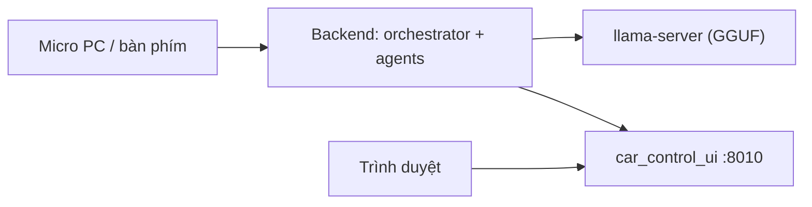

# PC Setup (người dùng — Windows / amd64)

Hướng dẫn cài đặt và chạy **Orchestrator-on-Edge** trên máy PC amd64 (Windows + Docker Desktop/WSL2 + GPU NVIDIA). Tài liệu này dành cho **người dùng cuối**; dev muốn sửa code xem [`DEV_SETUP.md`](DEV_SETUP.md).

Có 2 cách chạy:

- **Host mode** (`run_all_pc.ps1`, mặc định): backend chạy bằng Python trên host với **stub phần cứng** (`stubs/`) → không cần phần cứng xe, dùng **micro thật** của PC.
- **Docker mode** (`-Docker`): backend chạy trong container (`docker-compose.x86.yml`), có **UI mô phỏng xe** ở cổng 8010.



---

## 1. Yêu cầu

- **Windows 10/11 64-bit** + **Docker Desktop** (bật WSL2) nếu dùng Docker mode.
- **PowerShell 7+** (`pwsh`) — kiểm tra: `pwsh -v`.
- **Python 3.10+** (host mode) và `pip`.
- **Git** (để lấy code).
- **GPU NVIDIA + driver mới** (khuyến nghị). Không có GPU vẫn chạy được nhưng chậm hơn.
- Một **LLM server** tương thích OpenAI (`llama-server`, Ollama, hoặc OpenAI API).
- Dung lượng: **~10 GB** cho models.

## 2. Lấy code

```powershell
git clone <repo-url> orchestrator-on-edge
cd orchestrator-on-edge
```

## 3. Tải models (một lần)

```powershell
.\scripts\fetch_assets.ps1 --all
.\scripts\fetch_assets.ps1 verify      # phải in ALL OK
```

Tải GGUF, embedding model, Kokoro TTS, sherpa ASR/KWS và wheels. Chi tiết nguồn: [`ASSETS.md`](ASSETS.md).

## 4. Cấu hình

```powershell
Copy-Item .env.x86.example .env.x86
notepad .env.x86
```

Điền các giá trị cần thiết:

| Biến | Ghi chú |
|------|---------|
| `GRAPHQL_API_KEY`, `GRAPHQL_HOST`, `GRAPHQL_VEHICLE_ID` | Backend xe (nếu dùng) |
| `OPENAI_API_KEY` | Nếu dùng OpenAI thay LLM local |
| `LOCAL_LLM_URL` | Mặc định `http://host.docker.internal:8080/v1` |
| `LLM_MODEL_FILE` | `Qwen3.5-4B-Q4_K_M.gguf` |

> Không commit `.env.x86` (đã gitignore).

## 5. Chạy LLM server

Chạy `llama-server` với GGUF đã tải:

```powershell
llama-server -m .\llama-cpp\models\Qwen3.5-4B-Q4_K_M.gguf --jinja --host 0.0.0.0 --port 8080 -ngl 99 -fa
```

(Docker mode: container gọi qua `host.docker.internal:8080`. Nếu dùng OpenAI/Ollama thì trỏ `LOCAL_LLM_URL` tương ứng và bỏ qua bước này.)

## 6. Chạy ứng dụng

Host mode (micro thật):

```powershell
.\run_all_pc.ps1
```

Các tùy chọn hữu ích:

```powershell
.\run_all_pc.ps1 -VoiceStub     # nhập bằng bàn phím thay vì micro
.\run_all_pc.ps1 -Docker        # backend trong Docker + UI mô phỏng xe
.\run_all_pc.ps1 -SkipVoice     # chỉ backend
.\run_all_pc.ps1 -Down          # dừng tất cả
```

Mỗi service mở trong cửa sổ riêng (tiêu đề `[(service)]`). Docker mode dùng `docker-compose.x86.yml` + `.env.x86`.

## 7. Truy cập

| Thành phần | URL |
|-----------|-----|
| Orchestrator API + Swagger | http://localhost:8000/docs |
| Danh sách agent | http://localhost:8000/v1/agents |
| UI mô phỏng xe (Docker mode) | http://localhost:8010 |
| Web chat (profile `optional`) | http://localhost:3000 |

## 8. Kiểm tra nhanh

```powershell
Invoke-RestMethod http://localhost:8000/health
Invoke-RestMethod -Method Post http://localhost:8000/v1/orchestrator/message `
  -ContentType "application/json" `
  -Body '{"message":"Turn on the headlights","session_id":"pc"}'
```

Trong cửa sổ voice, bạn có thể nói (hoặc gõ nếu dùng `-VoiceStub`) và nhận câu trả lời.

## Xử lý sự cố

| Triệu chứng | Cách xử lý |
|-------------|-----------|
| `fetch_assets` báo MISSING/TOO SMALL | Chạy lại `.\scripts\fetch_assets.ps1 --all`; kiểm tra mạng/`HF_TOKEN` |
| Container không gọi được LLM | Đảm bảo `llama-server` đang chạy ở `:8080` và `LOCAL_LLM_URL=...host.docker.internal:8080/v1` |
| Không có tiếng / mic | Kiểm tra thiết bị âm thanh mặc định; thử `-VoiceStub` để loại trừ mic |
| GPU không dùng | Kiểm tra `nvidia-smi` và driver; Docker Desktop cần WSL2 + NVIDIA driver cập nhật |
| Port bận | Đổi `ORCHESTRATOR_PORT` trong `.env.x86` và port tương ứng trong compose |
| Cần dừng sạch | `.\run_all_pc.ps1 -Down` |
