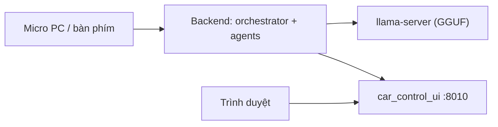

# PC Setup (người dùng — Windows / amd64)

Hướng dẫn cài đặt và chạy **Orchestrator-on-Edge** trên máy PC amd64 (Windows + Docker Desktop/WSL2 + GPU NVIDIA). Tài liệu này dành cho **người dùng cuối**; dev muốn sửa code xem [`DEV_SETUP.md`](DEV_SETUP.md).

Có 2 cách chạy:

- **Host mode** (`run_all_pc.ps1`, mặc định): backend chạy bằng Python trên host với **stub phần cứng** (`stubs/`) → không cần phần cứng xe, dùng **micro thật** của PC.
- **Docker mode** (`-Docker`): backend chạy trong container (`docker-compose.x86.yml`), có **UI mô phỏng xe** ở cổng 8010.



---

## 1. Yêu cầu

- **Windows 10/11 64-bit** + **Docker Desktop** (bật WSL2) nếu dùng Docker mode.
- **PowerShell 7+** (`pwsh`) — kiểm tra: `pwsh -v`.
- **Python 3.10+** (host mode) và `pip`.
- **Git** (để lấy code).
- **GPU NVIDIA + driver mới** (khuyến nghị). Không có GPU vẫn chạy được nhưng chậm hơn.
- Một **LLM server** tương thích OpenAI (`llama-server`, Ollama, hoặc OpenAI API).
- Dung lượng: **~10 GB** cho models.

## 2. Lấy code

```powershell
git clone <repo-url> orchestrator-on-edge
cd orchestrator-on-edge
```

## 3. Tải models (một lần)

```powershell
.\scripts\fetch_assets.ps1 --all
.\scripts\fetch_assets.ps1 verify      # phải in ALL OK
```

Tải GGUF, embedding model, Kokoro TTS, sherpa ASR/KWS và wheels. Chi tiết nguồn: [`ASSETS.md`](ASSETS.md).

## 4. Cấu hình

```powershell
Copy-Item .env.x86.example .env.x86
notepad .env.x86
```

Điền các giá trị cần thiết:

| Biến | Ghi chú |
|------|---------|
| `GRAPHQL_API_KEY`, `GRAPHQL_HOST`, `GRAPHQL_VEHICLE_ID` | Backend xe (nếu dùng) |
| `OPENAI_API_KEY` | Nếu dùng OpenAI thay LLM local |
| `LOCAL_LLM_URL` | Mặc định `http://host.docker.internal:8080/v1` |
| `LLM_MODEL_FILE` | `Qwen3.5-4B-Q4_K_M.gguf` |

> Không commit `.env.x86` (đã gitignore).

## 5. Chạy LLM server

Chạy `llama-server` với GGUF đã tải:

```powershell
llama-server -m .\llama-cpp\models\Qwen3.5-4B-Q4_K_M.gguf --jinja --host 0.0.0.0 --port 8080 -ngl 99 -fa
```

(Docker mode: container gọi qua `host.docker.internal:8080`. Nếu dùng OpenAI/Ollama thì trỏ `LOCAL_LLM_URL` tương ứng và bỏ qua bước này.)

## 6. Chạy ứng dụng

Host mode (micro thật):

```powershell
.\run_all_pc.ps1
```

Các tùy chọn hữu ích:

```powershell
.\run_all_pc.ps1 -VoiceStub     # nhập bằng bàn phím thay vì micro
.\run_all_pc.ps1 -Docker        # backend trong Docker + UI mô phỏng xe
.\run_all_pc.ps1 -SkipVoice     # chỉ backend
.\run_all_pc.ps1 -Down          # dừng tất cả
```

Mỗi service mở trong cửa sổ riêng (tiêu đề `[(service)]`). Docker mode dùng `docker-compose.x86.yml` + `.env.x86`.

## 7. Truy cập

| Thành phần | URL |
|-----------|-----|
| Orchestrator API + Swagger | http://localhost:8000/docs |
| Danh sách agent | http://localhost:8000/v1/agents |
| UI mô phỏng xe (Docker mode) | http://localhost:8010 |
| Web chat (profile `optional`) | http://localhost:3000 |

## 8. Đa ngôn ngữ (Anh / Nhật / Việt)

Trên x86, pipeline nhận **tiếng Anh, Nhật, Việt** và trả lời bằng TTS đúng
ngôn ngữ đó (dựa trên kiến trúc [sherpa-onnx](https://github.com/k2-fsa/sherpa-onnx)):

- **STT**: **Whisper trên GPU** — `STT_BACKEND=whisper` (**đồng nhất x86 & Jetson**):
  x86 dùng faster-whisper/CUDA (`large-v3`), Jetson dùng TensorRT (`whisper_trt`).
  Một model nhận cả vi/en/ja và tự phát hiện ngôn ngữ.
  Dự phòng: `sherpa_whisper` (CPU) / `sherpa_onnx` (SenseVoice).
- **Ngôn ngữ lượt nói**: lấy từ kết quả STT, truyền thẳng sang orchestrator
  (`language` hint) để LLM **trả lời đúng ngôn ngữ**; `voice_processing/lang.py`
  là dự phòng.
- **TTS**: tiếng Anh `af_heart`, tiếng Nhật `jf_alpha` + `misaki[ja]` (Kokoro);
  tiếng Việt dùng **Piper vi_VN** (sherpa-onnx VITS).

Tải model đa ngữ (một lần):

```powershell
.\scripts\fetch_assets.ps1 asr-fw       # faster-whisper large-v3 (~3 GB, GPU)
.\scripts\fetch_assets.ps1 tts-vi       # Piper tiếng Việt (~60 MB)
```

Cấu hình liên quan trong `.env.x86`:

```dotenv
STT_BACKEND=whisper
STT_LANGUAGE=auto
FASTER_WHISPER_MODEL=/app/agent_assets/models/faster_whisper/large-v3
FASTER_WHISPER_DEVICE=cuda
FASTER_WHISPER_COMPUTE=float16
# TTS_LANGUAGE=              # để trống = nói theo ngôn ngữ từng lượt
PIPER_VI_DIR=/app/agent_assets/models/tts/vits-piper-vi_VN-vais1000-medium
```

> Để ép một ngôn ngữ cố định, đặt `TTS_LANGUAGE=en` (hoặc `ja`/`vi`). Ngôn ngữ
> Kokoro/chưa hỗ trợ (Hàn) hiện dùng giọng Anh dự phòng.

**Tốc độ STT:** Whisper đa ngữ chậm hơn SenseVoice (đo trên CPU int8, audio
7.15 s): SenseVoice 0.20 s (RTF 0.03) vs Whisper-small 1.94 s (RTF 0.27). Muốn
nhanh hơn thì dùng model nhỏ hơn:

```powershell
$env:STT_WHISPER_MODEL="base"     # hoặc "tiny"; mặc định "small"
.\scripts\fetch_assets.ps1 asr-whisper
# rồi đặt STT_WHISPER_MODEL=base trong .env.x86
```

Whisper vẫn nhanh hơn thời gian thực (RTF < 1). ASR **không streaming** — pipeline
cắt theo VAD rồi nhận dạng từng đoạn (offline), giống trước; chỉ có phần trả lời
(orchestrator token + phát TTS theo chunk) là streaming.

## 9. GPU (tùy chọn)

Chọn execution provider bằng env (mặc định `cpu`, tự fallback cpu nếu không có):

| Biến | Dùng cho | Ghi chú |
|------|----------|---------|
| `ONNX_PROVIDER` | Kokoro TTS, Silero VAD | `cuda` cần `onnxruntime-gpu` (đã có trong base) |
| `SHERPA_PROVIDER` | sherpa ASR (SenseVoice/Whisper) + wake word | **chỉ `cuda` nếu sherpa-onnx build GPU** |
| `VAD_PROVIDER` | Silero VAD | nên giữ `cpu` (model nhỏ, GPU chậm hơn) |

- **Kokoro TTS**: hỗ trợ GPU sẵn — tự dùng `CUDAExecutionProvider` khi có.
- **sherpa-onnx ASR**: bản PyPI là **CPU-only**. Muốn GPU phải build từ source với
  `-DSHERPA_ONNX_ENABLE_GPU=ON` (hoặc wheel GPU trên Jetson) rồi đặt `SHERPA_PROVIDER=cuda`.
  Nếu chưa có GPU build, sherpa chỉ cảnh báo và chạy CPU (không lỗi).
- **VAD / wake word**: rất nhỏ, chạy GPU thêm overhead → để CPU.

Ví dụ bật Kokoro trên GPU (x86):

```dotenv
ONNX_PROVIDER=cuda
SHERPA_PROVIDER=cpu   # trừ khi có sherpa-onnx GPU build
VAD_PROVIDER=cpu
```

## 10. Tinh chỉnh chống nhiễu & VAD

### Vì sao hay nhận nhầm thành "Yeah."
**AEC không khử tiếng ồn nền** — nó chỉ khử **echo** (âm từ loa quay lại mic).
Tiếng ồn phòng/mic yếu là việc của **NS + AGC**. Khi VAD kích nhầm trên nhiễu,
một đoạn ngắn được đưa vào Whisper và Whisper hay "bịa" các câu ngắn kiểu
`Yeah.`, `Thank you.`, `(phone beeps)`. Cách xử lý theo 3 lớp:

**Lớp 1 — Preprocessing (AEC/NS/AGC):**

| Biến | Ý nghĩa |
|------|---------|
| `AEC_ENABLED=1` | Bật WebRTC APM (khử echo) |
| `AEC_NOISE_SUPPRESS=1` | Bật NS (giảm ồn nền) |
| `AEC_NS_LEVEL` | `low` \| `moderate` \| `high` \| `very_high` (ồn nhiều → `very_high`) |
| `AEC_TRANSIENT_SUPPRESS=1` | Khử click/lách tách |
| `AEC_AGC_ENABLED=1` + `AEC_AGC_*` | Nâng mic yếu (đừng tăng quá kẻo khuếch đại ồn) |

**Lớp 2 — VAD (đừng để nhiễu kích hoạt):**

| Biến | Nghĩa |
|------|-------|
| `VAD_DETECT_THRESHOLD` | Ngưỡng xác nhận speech (tăng 0.55 → 0.65 khi ồn) |
| `VAD_THRESHOLD_HIGH` / `VAD_THRESHOLD_LOW` | Hysteresis vào/ra speech |
| `VAD_WINDOW_SIZE` | Số frame liên tiếp mới tính là speech (tăng 3 → 4–5) |
| `SEGMENT_SILENCE` | Im lặng bao lâu thì **chốt 1 segment** để STT |
| `TURN_END_SILENCE` | Im lặng bao lâu thì **kết thúc lượt** (turn end) |

> **VAD có tự nhận biết hết câu không?** Có — turn kết thúc khi im lặng liên tục
> `TURN_END_SILENCE` giây (mặc định 2.5s) sau tiếng nói cuối. Nếu nhiễu làm
> `prob` luôn > ngưỡng thì `last_voice_time` liên tục được cập nhật → **turn
> không bao giờ kết thúc**. Cách sửa: tăng `VAD_DETECT_THRESHOLD` +
> `VAD_WINDOW_SIZE`, bật NS, hoặc giảm `AEC_AGC_MAX_GAIN_DB`.

**Lớp 3 — Lọc trước/sau STT:**

| Biến | Nghĩa |
|------|-------|
| `MIN_SEGMENT_SEC` | Bỏ đoạn quá ngắn (mặc định code 0.095 → nên 0.20) |
| `STT_MIN_RMS` | Bỏ đoạn quá yếu (năng lượng thấp) trước khi vào STT |
| `STT_DROP_SHORT_HALLUCINATIONS=1` | Lọc câu bịa ngắn của Whisper |
| `STT_HALLUCINATION_BLOCKLIST` | Thêm câu cần chặn, cách nhau bởi dấu phẩy |
| `FW_NO_SPEECH_THRESHOLD` | faster-whisper: bỏ segment no-speech (mặc định 0.6) |
| `FW_MIN_AVG_LOGPROB` | faster-whisper: bỏ segment độ tin cậy thấp (mặc định -1.0) |

**Baseline phòng ồn** (thử rồi chỉnh dần):

```dotenv
AEC_NOISE_SUPPRESS=1
AEC_NS_LEVEL=very_high
AEC_AGC_ENABLED=1
VAD_DETECT_THRESHOLD=0.65
VAD_THRESHOLD_HIGH=0.65
VAD_THRESHOLD_LOW=0.25
VAD_WINDOW_SIZE=4
MIN_SEGMENT_SEC=0.20
STT_MIN_RMS=0.010
STT_DROP_SHORT_HALLUCINATIONS=1
TURN_END_SILENCE=2.0
```

Xem log để chẩn đoán: `[VAD] prob=... threshold=...` (nhiễu kích), `[STT] Skip
low-energy segment ...` (gate chặn), `kept=N` (số segment giữ lại sau lọc).

### 10.1 Công cụ tinh chỉnh ngưỡng (visualize)

`voice_processing/tools/vad_tune.py` chạy đúng Silero VAD + logic turn-end của
pipeline, in **timeline xác suất ASCII** và gợi ý ngưỡng, giúp đặt
`VAD_DETECT_THRESHOLD` / `VAD_WINDOW_SIZE` / `SEGMENT_SILENCE` / `TURN_END_SILENCE`
phù hợp với môi trường thật.

```bash
# trong container (dep đã có sẵn)
docker compose -f docker-compose.x86.yml run --rm voice_processing \
  python3 tools/vad_tune.py --wav /app/input_test/sample.wav --sweep

# thu trực tiếp từ mic 8s rồi phân tích (host mode)
python voice_processing/tools/vad_tune.py --record 8
# thử ngưỡng ứng viên không cần sửa .env
python voice_processing/tools/vad_tune.py --wav sample.wav --detect 0.65 \
  --high 0.65 --low 0.25 --window 4 --turn-end 1.0
# kèm phiên âm từng segment
python voice_processing/tools/vad_tune.py --wav sample.wav --stt
```

- `#` = trên ngưỡng high, `=` = trong dải hysteresis, `.` = dưới low, `|` = chốt
  segment, `T` = kết thúc turn. Xuất CSV để vẽ bằng Excel/gnuplot.
- Gợi ý `noise_p20` / `speech_p90` và các ngưỡng tương ứng in ở cuối.

### 10.2 Nhiều người nói / giao tiếp với xe

Với **1 micro** hiện tại, cách tách người nói hiệu quả nhất là **lấy wake word
làm "enrollment"** (chỉ người gọi "Hey Dora" mới được nói) — pipeline đã làm
điều này. Muốn tách/khử người nói khác, các dự án nền tảng (đã khảo sát):

| Mục tiêu | Dự án | License |
|----------|-------|---------|
| Diarization (ai nói khi nào) + overlapped speech | `pyannote/pyannote-audio` | MIT |
| All-in-one ASR + VAD + diarization | `modelscope/FunASR` | MIT |
| Speech enhancement + separation (tách giọng) | `modelscope/ClearerVoice-Studio` | Apache-2.0 |
| Target-speaker extraction / separation | `speechbrain/speechbrain` (SepFormer, SpeakerBeam) | Apache-2.0 |
| Nhận người nói gần/hướng bằng mảng mic | cần **mic array** + DOA (không dùng được với 1 mic) | — |

Hướng đề xuất: giữ wake-word gating + thêm **target-speaker extraction** (khởi
tạo bằng chính wake word) để lọc giọng người đang nói với xe trước khi đưa vào
ASR. Việc tích hợp là thay đổi lớn (model + GPU) — cần xác nhận trước khi làm.

## 11. Tiền xử lý (AEC / NS / AGC) — đang làm gì

Chuỗi: `mic → WebRTC APM (aec.process_near) → VAD → wake word → STT`. Tham chiếu
far-end cho AEC là **audio loa đang phát** (`aec.feed_far`), nên echo TTS bị khử.

**Đã bật sẵn** (trong `aec.py`, khối `_init_apm`):

| Stage | Env | Mặc định |
|-------|-----|----------|
| AEC (khử echo) | `AEC_ENABLED` | `1` |
| High-pass (cắt rumble) | `AEC_HPF_FULL_BAND` | `1` |
| Noise suppression | `AEC_NS_LEVEL` = `low\|moderate\|high\|very_high` | `high` |
| Transient (click/tap) | `AEC_TRANSIENT_SUPPRESS` | `1` |
| AGC2 nâng mic yếu | `AEC_AGC_ENABLED` + `AEC_AGC_*` | `1` |
| Pre-amp cố định (tùy chọn) | `AEC_PRE_GAIN` (linear) | `1.0` (tắt) |

**Mới thêm (tùy chọn, mặc định tắt — không đổi hành vi cũ):**

| Env | Ý nghĩa |
|-----|---------|
| `AEC_NS_LINEAR=1` | NS phân tích linear-AEC output → khử ồn mạnh hơn |
| `AEC_AGC1_ENABLED=1` | AGC1 **target-level** + limiter (đẩy giọng yếu lên mức chuẩn) |
| `AEC_AGC1_TARGET_DBFS` | mức đích (mặc định `-3`) |
| `AEC_AGC1_COMPRESSION_DB` | nén (mặc định `9`) |
| `AEC_AGC1_LIMITER=1` | chống vỡ tiếng |
| `AEC_MOBILE_MODE`, `AEC_EXPORT_LINEAR` | tùy chọn echo canceller |

**Chưa có (cần xác nhận nếu muốn):**
- **Deep denoise** (RNNoise / DeepFilterNet / DTLN) — khử ồn phi dừng tốt hơn NS cổ điển của WebRTC.
- **Beamforming / GSC**: WebRTC APM chỉ beamform khi `capture` ≥ 2 kênh; hiện
  stream là **mono** nên **GSC không hoạt động**. Muốn "bắt người nói gần/hướng"
  phải có **mảng mic** + DOA.

**Gợi ý cho phòng ồn + mic yếu:**

```dotenv
AEC_NOISE_SUPPRESS=1
AEC_NS_LEVEL=very_high
AEC_NS_LINEAR=1
AEC_TRANSIENT_SUPPRESS=1
AEC_AGC_ENABLED=1
AEC_AGC_MAX_GAIN_DB=36
AEC_AGC_MAX_NOISE_DBFS=-45
AEC_AGC1_ENABLED=1        # target-level: giọng yếu → đủ to cho model
AEC_AGC1_TARGET_DBFS=-3
AEC_AGC1_LIMITER=1
```

> Lưu ý: AGC2 và AGC1 cùng bật có thể tăng khuếch đại ồn — theo dõi log
> `[AEC] Active ... agc=True agc1=True ns=...` và dùng
> `voice_processing/tools/vad_tune.py` để kiểm tra nhiễu có bị kích VAD không.

### 11.1 Audio Lab — nghe & xem trước/sau preprocessing

`voice_processing/tools/audio_lab/` — web UI: **thu âm (hoặc tải WAV)** → áp
chuỗi tiền xử lý (AEC/NS/HPF/transient/AGC2, tuỳ chọn AGC1 + denoise) → hiển thị
**waveform, spectrogram, mức RMS/peak dBFS** cạnh nhau và **nghe A/B**.

```bash
pip install -r voice_processing/tools/audio_lab/requirements.txt
python voice_processing/tools/audio_lab/app.py        # http://localhost:8020
```

- Thử các mức `NS level`, `AGC2 max gain`, `AGC1 target`, `denoise`… rồi chép giá
  trị ưng ý vào `.env`.
- `denoise` dùng `noisereduce` (spectral gating) — cài để bật toggle; nếu chưa có,
  header báo "không".
- **AEC thật cần far-end (âm loa đang phát)**; lab offline không có playback
  reference nên AEC không khử được gì. Muốn thử AEC: chạy lab khi xe đang phát TTS.

## 8. Kiểm tra nhanh

```powershell
Invoke-RestMethod http://localhost:8000/health
Invoke-RestMethod -Method Post http://localhost:8000/v1/orchestrator/message `
  -ContentType "application/json" `
  -Body '{"message":"Turn on the headlights","session_id":"pc"}'
```

Trong cửa sổ voice, bạn có thể nói (hoặc gõ nếu dùng `-VoiceStub`) và nhận câu trả lời.

## Xử lý sự cố

| Triệu chứng | Cách xử lý |
|-------------|-----------|
| `fetch_assets` báo MISSING/TOO SMALL | Chạy lại `.\scripts\fetch_assets.ps1 --all`; kiểm tra mạng/`HF_TOKEN` |
| Container không gọi được LLM | Đảm bảo `llama-server` đang chạy ở `:8080` và `LOCAL_LLM_URL=...host.docker.internal:8080/v1` |
| Không có tiếng / mic | Kiểm tra thiết bị âm thanh mặc định; thử `-VoiceStub` để loại trừ mic |
| GPU không dùng | Kiểm tra `nvidia-smi` và driver; Docker Desktop cần WSL2 + NVIDIA driver cập nhật |
| Port bận | Đổi `ORCHESTRATOR_PORT` trong `.env.x86` và port tương ứng trong compose |
| Cần dừng sạch | `.\run_all_pc.ps1 -Down` |
