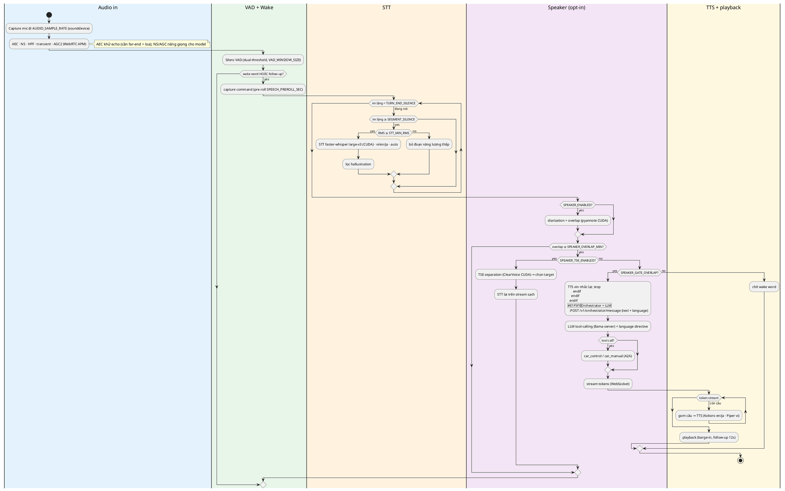
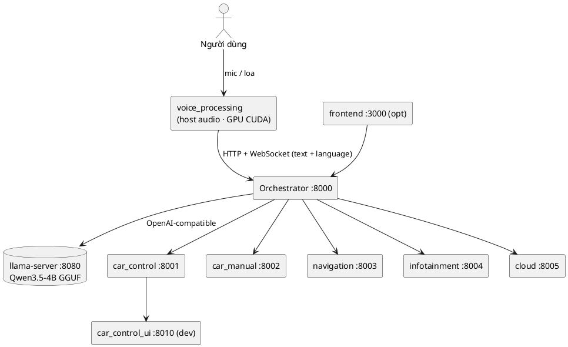
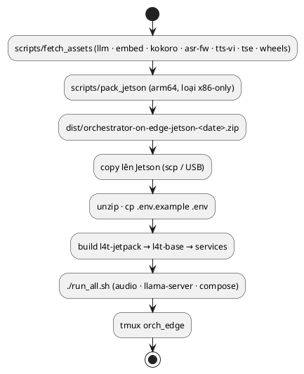

# Full Pipeline — chốt cấu hình & sơ đồ

Tài liệu này **chốt** trạng thái pipeline hiện tại và vẽ **full flow** bằng
[PlantUML](https://plantuml.com). Nguồn sơ đồ: [`pipeline.puml`](pipeline.puml).

## 1. Chốt cấu hình (defaults)

| Thành phần | x86 (dev GPU) | Jetson (arm64) |
|---|---|---|
| **STT** | `faster_whisper` (CTranslate2, `large-v3`, CUDA float16) | `sherpa_onnx`/SenseVoice (mặc định repo) — đổi sang `faster_whisper` khi cần |
| **ASR fallback** | `sherpa_whisper` (CPU), `sherpa_onnx` | `whisper_trt` (TensorRT) / `sherpa_onnx` |
| **TTS** | Kokoro (en `af_heart`, ja `jf_alpha` + `misaki[ja]`), **Piper vi_VN** | Kokoro (en), Piper vi_VN (nếu fetch) |
| **Ngôn ngữ** | `STT_LANGUAGE=auto`; LLM nhận **language hint** từ STT | như trên |
| **Preprocessing** | WebRTC APM: AEC + NS (moderate) + NS linear-AEC + HPF + transient + AGC2 (`max_noise=-18`) | như trên |
| **VAD** | Silero dual-threshold, `VAD_WINDOW_SIZE=3`, `TURN_END_SILENCE=1.0` | như trên |
| **Speaker stage** | opt-in: `SPEAKER_ENABLED`, `SPEAKER_TSE_ENABLED` (pyannote + ClearVoice, CUDA) | như trên (cần fetch model) |
| **Provider GPU** | `ONNX_PROVIDER`/`SHERPA_PROVIDER`/`VAD_PROVIDER` = `cpu` mặc định, đặt `cuda` khi có GPU build | như trên |
| **LLM** | llama-server (Qwen3.5-4B GGUF), tool-calling | như trên |

> GPU đã sẵn cho **TTS (Kokoro ORT CUDA)**, **ASR (faster-whisper CUDA / Whisper TensorRT)**, **diarization/TSE (torch CUDA)**. VAD/wake word để CPU (model nhỏ).

## 2. Các giai đoạn (stage) & biến bật/tắt

| # | Stage | Công cụ | Env chính |
|---|-------|---------|-----------|
| 1 | Tiền xử lý | WebRTC APM (`aec.py`) | `AEC_ENABLED`, `AEC_NS_LEVEL`, `AEC_NS_LINEAR`, `AEC_AGC_*`, `AEC_AGC1_*` |
| 2 | VAD | Silero (`vad.py`) | `VAD_THRESHOLD_HIGH/LOW`, `VAD_DETECT_THRESHOLD`, `VAD_WINDOW_SIZE` |
| 3 | Wake word | openWakeWord / sherpa KWS | `WAKE_WORD_BACKEND`, `WAKE_WORD_THRESHOLD` |
| 4 | Cắt lượt | `main.py` | `SEGMENT_SILENCE`, `TURN_END_SILENCE`, `MIN_SEGMENT_SEC`, `STT_MIN_RMS` |
| 5 | STT | `faster_whisper` / `sherpa_whisper` / SenseVoice | `STT_BACKEND`, `STT_LANGUAGE`, `FASTER_WHISPER_*`, `STT_WHISPER_*` |
| 6 | Lọc hallucination | `stt.py` | `STT_DROP_SHORT_HALLUCINATIONS`, `STT_HALLUCINATION_BLOCKLIST`, `FW_*` |
| 7 | Speaker (opt-in) | pyannote (`speaker.py`) | `SPEAKER_ENABLED`, `SPEAKER_GATE_OVERLAP`, `SPEAKER_OVERLAP_MIN` |
| 8 | TSE (opt-in) | ClearVoice (`tse.py`) | `SPEAKER_TSE_ENABLED`, `TSE_MODEL`, `TSE_REF_SEC` |
| 9 | LLM | orchestrator (`route_orchestrator.py`) | `LOCAL_LLM_URL`, `language` hint, `_language_directive` |
| 10 | TTS | Kokoro + Piper (`tts.py`) | `TTS_LANGUAGE`, `TTS_VOICE_*`, `PIPER_VI_DIR` |

## 3. Full flow (PlantUML)

### 3.1 Runtime — voice pipeline



### 3.2 Deployment — services & ports



### 3.3 Build & deploy — asset → bundle → run



## 4. Render PlantUML

- **GitLab**: render trực tiếp khối ` ```plantuml ` trong markdown; hoặc commit `pipeline.puml` (GitLab hiển thị).
- **GitHub**: không render sẵn — dùng [PlantUML proxy](https://github.com/plantuml/plantuml-server) / extension VSCode `jebbs.plantuml`, hoặc PlantUML CLI:
  ```bash
  plantuml -tpng docs/pipeline.puml
  ```
- Nguồn gộp 3 sơ đồ: [`pipeline.puml`](pipeline.puml).

## 5. Trạng thái & việc còn lại

- **Đã chốt:** STT đa ngữ vi/en/ja (GPU), chống ồn/ hallucination, TTS theo ngôn ngữ, LLM trả lời đúng tiếng (language hint), speaker diarization + TSE (opt-in), tools (Audio Lab, VAD tuner, benchmark).
- **Kết quả benchmark:** xem [`BENCHMARK.md`](BENCHMARK.md).
- **Còn lại:** (1) bật pyannote embedding để chọn target chính xác; (2) tách VRAM khi chạy TSE chung large-v3; (3) benchmark 2 giọng cùng ngôn ngữ.
