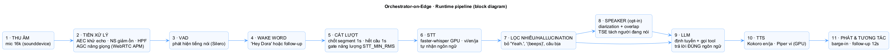
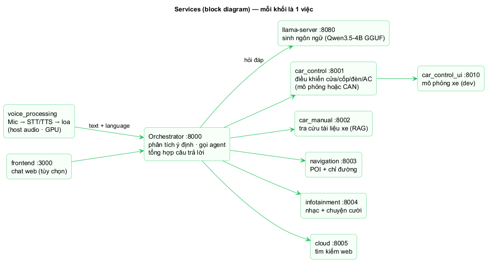
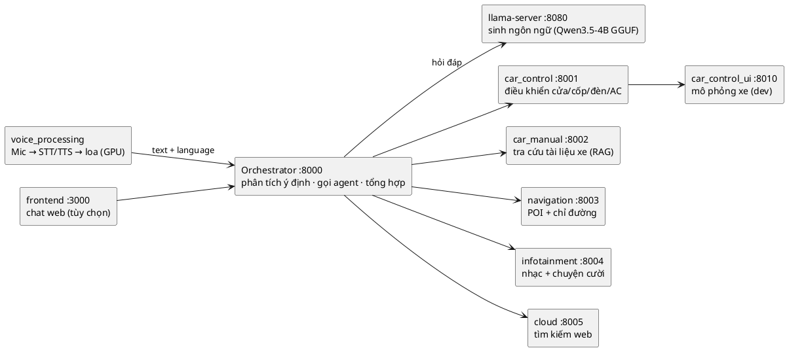
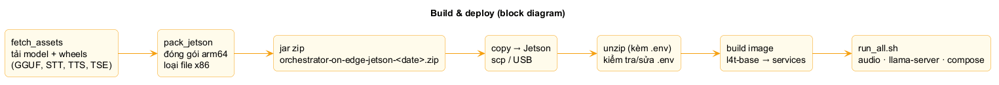

# Full Pipeline — sơ đồ khối (block diagram)

Sơ đồ đơn giản: mỗi khối là **một việc** pipeline làm. Nguồn PlantUML:
[`pipeline.puml`](pipeline.puml). Ảnh PNG (dùng cho GitHub): [`images/`](images).

## 1. Runtime — các bước xử lý một lượt nói

```plantuml
@startuml Runtime - block diagram
left to right direction
rectangle "1 · THU ÂM\nmic 16k (sounddevice)" as A
rectangle "2 · TIỀN XỬ LÝ\nAEC khử echo · NS giảm ồn · HPF\nAGC nâng giọng (WebRTC APM)" as B
rectangle "3 · VAD\nphát hiện tiếng nói (Silero)" as C
rectangle "4 · WAKE WORD\n'Hey Dora' hoặc follow-up" as D
rectangle "5 · CẮT LƯỢT\nchốt segment 1s · hết câu 1s\ngate năng lượng STT_MIN_RMS" as E
rectangle "6 · STT\nfaster-whisper GPU · vi/en/ja\ntự nhận ngôn ngữ" as F
rectangle "7 · LỌC NHIỄU/HALLUCINATION\nbỏ 'Yeah.', '(beeps)', câu bịa" as G
rectangle "8 · SPEAKER (opt-in)\ndiarization + overlap\nTSE tách người đang nói" as H
rectangle "9 · LLM\nđịnh tuyến + gọi tool\ntrả lời ĐÚNG ngôn ngữ" as I
rectangle "10 · TTS\nKokoro en/ja · Piper vi (GPU)" as J
rectangle "11 · PHÁT & TƯƠNG TÁC\nbarge-in · follow-up 12s" as K
A --> B
B --> C
C --> D
D --> E
E --> F
F --> G
G --> H
G --> I
H --> I
I --> J
J --> K
@enduml
```





| Khối | Việc nó làm | Env chính |
|------|-------------|-----------|
| 1 · Thu âm | Lấy audio mic 16 kHz | `AUDIO_SAMPLE_RATE`, `AUDIO_CHUNK` |
| 2 · Tiền xử lý | Khử echo, giảm ồn, nâng giọng | `AEC_*`, `AEC_AGC*`, `AEC_NS_LEVEL` |
| 3 · VAD | Biết lúc nào có tiếng nói | `VAD_THRESHOLD_*`, `VAD_DETECT_THRESHOLD` |
| 4 · Wake word | Đánh thức / follow-up | `WAKE_WORD_*`, `FOLLOWUP_LISTEN_SEC` |
| 5 · Cắt lượt | Chốt segment & kết thúc câu; bỏ đoạn yếu | `SEGMENT_SILENCE`, `TURN_END_SILENCE`, `STT_MIN_RMS` |
| 6 · STT | Chuyển giọng → chữ, vi/en/ja, tự nhận ngôn ngữ | `STT_BACKEND=whisper`, `WHISPER_MODEL` (chung 2 nền tảng) |
| 7 · Lọc nhiễu | Bỏ câu bịa khi gặp nhiễu/im lặng | `STT_DROP_SHORT_HALLUCINATIONS`, `FW_*` |
| 8 · Speaker (opt-in) | Phát hiện chồng tiếng & tách người đang nói | `SPEAKER_ENABLED`, `SPEAKER_TSE_ENABLED` |
| 9 · LLM | Chọn agent/tool, trả lời đúng ngôn ngữ | `LOCAL_LLM_URL`, `language` |
| 10 · TTS | Đọc câu trả lời theo ngôn ngữ | `TTS_LANGUAGE`, `PIPER_VI_DIR` |
| 11 · Phát | Phát audio, cho ngắt lời, nghe tiếp | `BARGE_IN_*`, `FOLLOWUP_LISTEN_SEC` |

## 2. Services — mỗi service một việc





## 3. Build & deploy — copy lên Jetson là chạy

```plantuml
@startuml Build - block diagram
left to right direction
rectangle "fetch_assets\ntải model + wheels" as A
rectangle "pack_jetson\nđóng gói arm64 (loại x86)" as B
rectangle "zip\norchestrator-on-edge-jetson-<date>.zip" as C
rectangle "copy → Jetson\nscp / USB" as D
rectangle "unzip (kèm .env)\nkiểm tra/sửa .env" as E
rectangle "build image\nl4t-base → services" as F
rectangle "run_all.sh\naudio · llama-server · compose" as G
A --> B
B --> C
C --> D
D --> E
E --> F
F --> G
@enduml
```





## Render PlantUML

- **GitLab**: render khối ` ```plantuml ` trực tiếp.
- **GitHub**: dùng ảnh PNG trong [`images/`](images) (đã render sẵn); hoặc VSCode `jebbs.plantuml`.
- **CLI**: `plantuml -tpng docs/pipeline.puml`

> Chốt cấu hình đầy đủ (x86/Jetson) và kết quả benchmark: xem [`BENCHMARK.md`](BENCHMARK.md) · [`SPEAKER_OVERLAP.md`](SPEAKER_OVERLAP.md).
